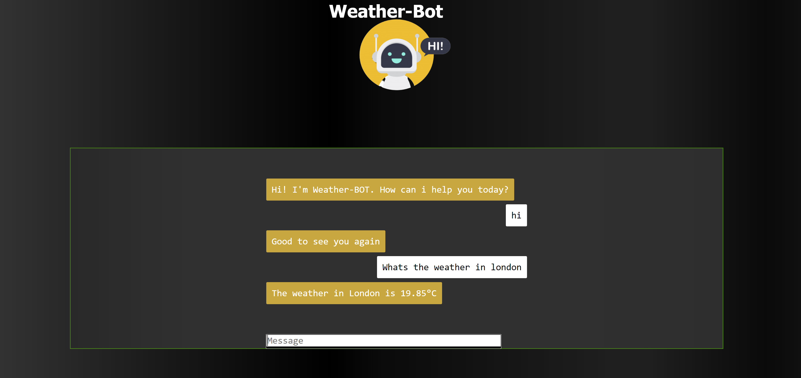

# Weather-Chatbot

##### Introduction
TODO: A weather and emission data retreiving chatbot trained on neural networks

##### Installation:
```pip install -r requirements.txt```

##### Configuration:

Update API Key for Open Weather Website

##### Launch:
python app.py

##### UI:
Open http://127.0.0.1:5000/  to chat with the bot


